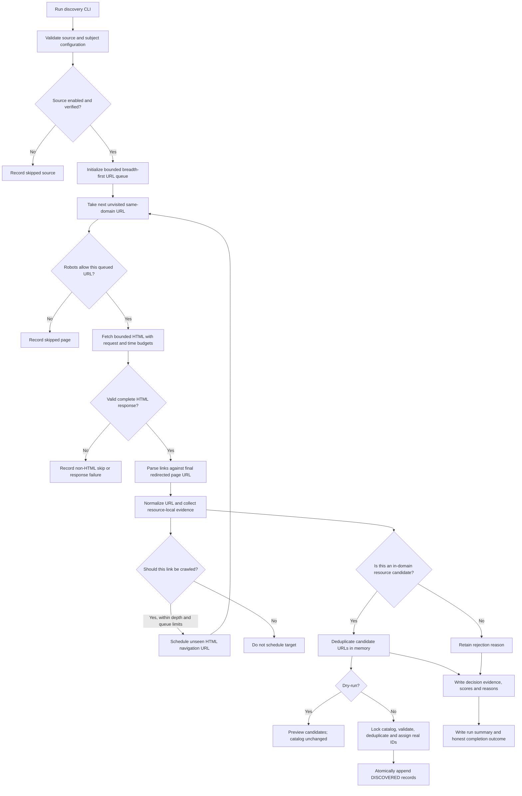
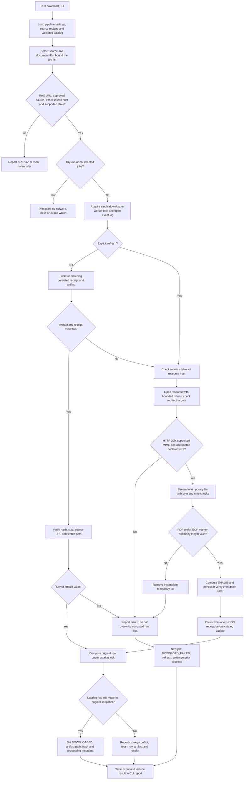
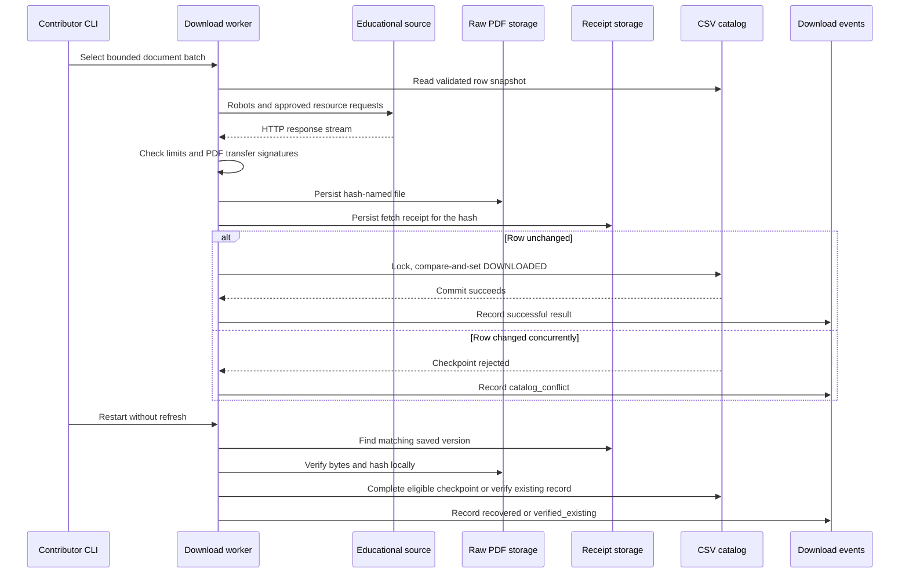
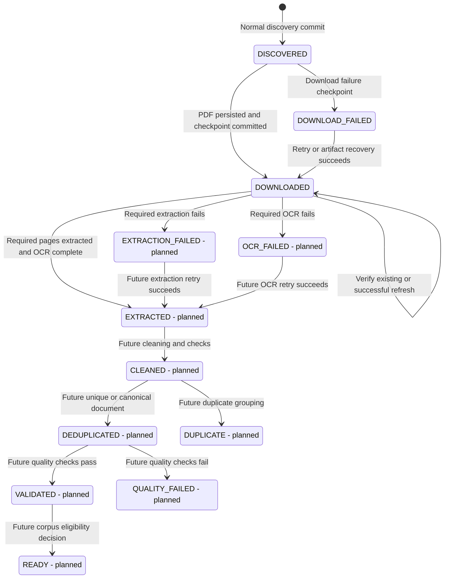
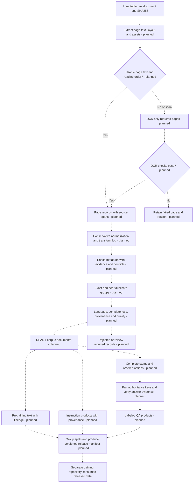
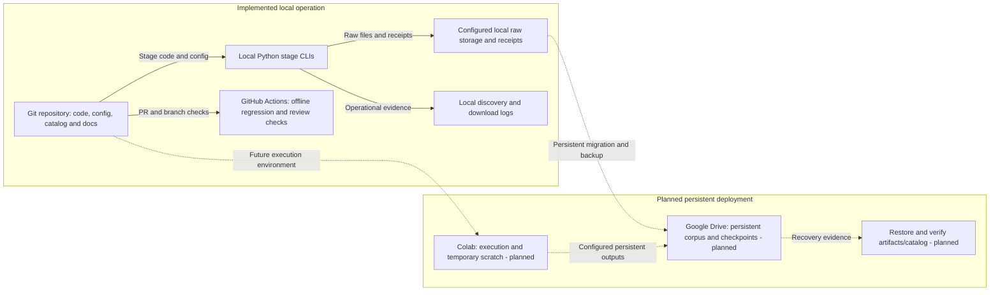

# Sinhala educational corpus: detailed pipeline architecture

Updated: 9 October 2026. These diagrams describe the current working tree, including the PDF downloader on `feat/pilot-downloader`. Discovery, review tooling and offline CI are implemented; extraction through dataset generation are planned. Model training belongs in the separate training repository.

GitHub renders the Mermaid blocks below. Each diagram focuses on one responsibility so the complete system can be read without one oversized chart.

## 1. Complete system and repository boundary

Solid arrows show implemented data/control flows. Dotted arrows show planned processing or a manual connection that has not been automated. Green nodes are implemented, amber nodes are planned, and grey nodes are external systems or human activities. Node labels also state status where necessary.

```mermaid
flowchart LR
    subgraph inputs["Inputs and configuration"]
        websites["Sri Lankan educational websites"]
        sourceConfig["configs/sources.yaml"]
        subjectConfig["configs/subjects.yaml"]
        pipelineConfig["configs/pipeline.yaml"]
        operator["Contributor runs stage CLI"]
    end

    subgraph collection["Implemented collection"]
        discovery["Discovery: HTML traversal and link classification"]
        discoveryAudit["Decision JSONL and run summary"]
        catalog["Catalog: documents.csv and stable document IDs"]
        download["PDF download: queue, transfer checks and checkpoint"]
        rawStore["Immutable PDFs and fetch receipts"]
        downloadEvents["Download events and CLI report"]
    end

    subgraph review["Implemented review tooling; human labels pending"]
        sample["Stratified sample CSV and manifest"]
        teammate["Teammate labels candidates through GitHub PR"]
        reviewReport["Validate labels and report unresolved rows"]
    end

    subgraph processing["Planned corpus processing"]
        extraction["Page extraction and selective OCR - planned"]
        cleaning["Cleaning and metadata enrichment - planned"]
        dedup["Exact and near deduplication - planned"]
        quality["Corpus quality validation and READY decision - planned"]
        datasets["Derived datasets and release manifests - planned"]
    end

    trainingRepo["Separate repository: model training and benchmark evaluation"]

    sourceConfig --> discovery
    subjectConfig --> discovery
    operator --> discovery
    websites -->|"HTML and robots policies"| discovery
    discovery --> discoveryAudit
    discovery -->|"Normal run only"| catalog
    discoveryAudit --> sample
    sample --> teammate
    teammate --> reviewReport
    operator --> download
    sourceConfig --> download
    pipelineConfig --> download
    catalog -->|"Eligible records"| download
    websites -->|"Approved PDF transfers"| download
    download --> rawStore
    download -->|"Locked state update"| catalog
    download --> downloadEvents
    rawStore -.-> extraction
    extraction -.-> cleaning
    cleaning -.-> dedup
    dedup -.-> quality
    quality -.-> datasets
    datasets -.->|"Versioned data handoff"| trainingRepo

    classDef implemented fill:#e6f4ea,stroke:#287a3b,color:#172b1d;
    classDef planned fill:#fff4d6,stroke:#9b7100,color:#392d00;
    classDef external fill:#eef0f3,stroke:#657080,color:#202b38;
    class discovery,discoveryAudit,catalog,download,rawStore,downloadEvents,sample,reviewReport implemented;
    class extraction,cleaning,dedup,quality,datasets planned;
    class websites,operator,teammate,trainingRepo external;
```



There is no orchestrator that automatically executes all stages. A contributor invokes discovery and downloading separately. The candidate review report does not update the catalog or grant a download permission flag. The maintainer has authorised proceeding with candidate suitability as a provisional assumption; blank human labels remain blank, and no measured accuracy is claimed.

**Corpus vs datasets:** source PDFs and their transformed document records belong to the corpus. Training-ready text/QA examples are separate, versioned products generated later. Downloading a PDF does not create a labeled training example.

## 2. Discovery: crawling and candidate selection are separate

Entry point: `python3 -B -m pipeline.discovery.crawler`.



The classification branch and traversal branch run for each observed link; they are not alternatives. A category page can be crawlable while rejected as a document candidate. Direct file links are candidates but are not read as documents by discovery. The fetched page's title/URL can also be evaluated as a page candidate.

| Responsibility | Current behavior |
|---|---|
| Source selection | Only configured `enabled: true` and `verified: true` sources |
| Crawl boundary | Configured host and its subdomains; external redirects rejected |
| HTML transport | Bounded queue/depth/pages/requests, delay, transient retries and conservative robots outcomes |
| Link evidence | Anchor/title/filename; generic links may use a completed short row/item/card with one distinct destination |
| Evidence exclusions | Scripts/styles/templates, global heading inheritance, hidden/navigation context and ambiguous multi-link sections |
| Candidate metadata | Subject/domain, explicit grade/level and controlled document type; unknown/conflicting fields stay empty |
| Catalog write | Only normal mode; one local POSIX critical section for validation, URL deduplication, ID allocation and atomic replacement |
| Observability | `corpus/logs/discovery/*.decisions.jsonl`, `*.summary.json`, `*.log` |

Candidate scores are explainable integer heuristic scores, not calibrated probabilities. Discovery metadata is inferred from link evidence, not verified PDF content.

## 3. Downloading: selection, integrity, persistence and checkpoint

Entry point: `python3 -B -m pipeline.download.downloader`.



`DISCOVERED` and `DOWNLOAD_FAILED` records are considered before `DOWNLOADED` records. Existing downloaded records are eligible for integrity verification; without `--refresh`, a valid receipt avoids network access. Records that have advanced to extraction/cleaning are not downloaded again by this stage.

The download worker lock covers the run. The CSV lock is acquired only for each checkpoint, so discovery can append other records between download checkpoints. The compare-and-set protects a row changed by another contributor while the transfer was running. It does not overwrite that changed row.

| Default setting | Value and scope |
|---|---|
| Job limit | 5 documents across the selected batch |
| Byte limit | 50 MiB per PDF |
| Time budget | 300 seconds per source fetcher |
| Socket timeout | 20 seconds per blocking request/read operation |
| Request budget | 50 per source, including retries, redirects and robots requests |
| Request delay | At least 1 second; observed robots delays/rates may increase it |
| Request retries | At most 2 transient retries; server wait above 30 seconds is deferred |
| Content checks | PDF/octet-stream MIME, `%PDF-` prefix, `%%EOF` near the end and declared-length agreement |
| Host policy | Exact base host; external CDNs and even source subdomains are not currently downloaded |

These defaults are in `configs/pipeline.yaml`. Time checks occur between operations, so they are not hard process deadlines. Request opening has retries; an interrupted response body is retried from the beginning on a later run. PDF transport checks do not guarantee parseability, correct answers or educational quality.

## 4. Crash recovery and immutable versions

The persistence order is **raw PDF → receipt → catalog checkpoint → event**. A later failure must not destroy a successful raw artifact.



| Interruption point | Next-run behavior |
|---|---|
| Before a complete raw PDF | Failed/unfinished transfer is not accepted; a later run starts again |
| PDF exists but no receipt | Transfer may be repeated; the existing hash-named file is verified and reused |
| PDF and receipt exist, catalog not updated | Matching artifact is verified and checkpointed without another transfer |
| Catalog is already `DOWNLOADED` | Receipt/path/size/hash are checked; valid content is reused |
| Previous PDF is corrupt | Report failure and preserve the bytes for investigation; no silent overwrite |
| Refresh yields changed content | Add a new hash-named file and receipt; retain the previous version |
| Refresh fails | Retain the previous successful catalog state and raw version |

Deduplication is currently limited: the same document/hash is reused. Identical bytes from different document IDs can still be stored in separate directories. Cross-document exact and near deduplication is a planned stage.

## 5. Document lifecycle and planned processing

Only discovery and PDF download transitions currently run. The catalog recognises later state names, but recognition does not mean their stages exist.



There is no catalog state called `OCR_COMPLETE` or `METADATA_ENRICHED`. Planned OCR outcomes belong to page-level records, and metadata evidence can be added at several stages. A document should only reach `EXTRACTED` when all required pages have usable results.



Raw files are never replaced by extracted or cleaned output. Equations, diagrams, table structure, option labels, Sinhala characters and negation need preservation. Questions without complete options or supported answers must not silently become labeled QA examples. Source families and duplicate groups must stay together during future split creation.

## 6. Storage, provenance and deployment

| Location | Responsibility | Current state |
|---|---|---|
| `configs/sources.yaml` | Source IDs/names/base URLs, enabled and verified flags | Implemented |
| `configs/subjects.yaml` | Collection taxonomy, aliases, grade/level targets | Implemented; ranges are collection targets |
| `configs/pipeline.yaml` | Downloader paths, batch/byte/time/request settings | Implemented for PDF download |
| `corpus/catalog/documents.csv` | Stable document IDs, metadata, lifecycle, artifact path/hash | Implemented; 23 standard columns plus preserved extensions |
| `corpus/catalog/pilots.json` | Explicit annotations for incomplete initial pilot records | Implemented |
| `corpus/raw/pdf/<doc_id>/<sha256>.pdf` | Default immutable source content | Downloader implemented; production queue currently empty |
| `corpus/raw/pdf/<doc_id>/<sha256>.json` | Default fetch receipt and raw provenance | Implemented |
| `corpus/logs/discovery/` | Decisions, summaries and transient discovery logs | Implemented; ignored outputs |
| `corpus/logs/download/` | Download events and local smoke-test workspace | Implemented; ignored outputs |
| `reviews/discovery/<sample>/` | Git-trackable candidate review CSV and manifest | Implemented; labels pending |
| `corpus/extracted/` | Page/block text and assets linked to raw hashes | Planned |
| `corpus/clean/` | Clean documents and rejected/review-required output | Planned |
| `datasets/` | Derived dataset products and release manifests | Planned |

The raw corpus is authoritative content. The CSV tracks documents; receipts explain transfers; logs explain operations. None replaces the others. Downloaded PDFs and logs are ignored by Git; code, configuration, catalog metadata, documentation and curated review bundles are retained.



Absolute storage paths can already be configured, but Drive/Colab durability and recovery have not been demonstrated. Current locks are cooperative local POSIX locks, not a distributed locking service. A single downloader with one catalog/raw store is the supported arrangement.

## 7. What exists today and what happens next

**Implemented:** discovery and filtering; catalog validation/locking; discovery auditing; stratified review sampling/reporting; PDF download/recovery; offline checks and a Python-version CI matrix. The latest working tree passed 109 local tests, including 20 downloader tests. The new downloader branch still needs its own GitHub CI run after publication.

**Actual data:** the production catalog has eight initial `DISCOVERED` placeholders without source URLs. A downloader dry-run reports zero eligible jobs. The one real 2.1 MB PDF was acquired in the separate ignored workspace `corpus/logs/download/smoke_20261009/raw/`; it is not registered as a production corpus document. Its test ID is local to that isolated catalog. The 80-row candidate review remains pending.

**Next operational flow:** select actual resource URLs → add valid production discovery records or complete evidence-backed pilot rows → preview one download job → acquire a bounded PDF batch → verify stored hashes/receipts → checkpoint/backup persistent storage. Extraction and OCR come after reliable acquisition.

Examples:

```bash
# Discovery preview: fetches HTML and writes audit logs, but does not change catalog.
python3 -B -m pipeline.discovery.crawler --source alapiedu --dry-run --max-pages 10

# Download preview: no network or filesystem writes.
python3 -B -m pipeline.download.downloader --dry-run

# Once the chosen ID exists in the production catalog with a valid URL:
python3 -B -m pipeline.download.downloader --doc-id LK-EDU-000009 --max-documents 1

# Offline regression and review-bundle validation:
python3 -B scripts/check_offline.py
```

Further reading: [discovery guide](../pipeline/discovery/README.md), [downloader guide](../pipeline/download/README.md), [download validation](DOWNLOAD_VALIDATION_RESULTS.md), [data contracts](DATA_CONTRACTS.md), [review guide](DISCOVERY_REVIEW_GUIDE.md), and [TODO list](TODO.md).
